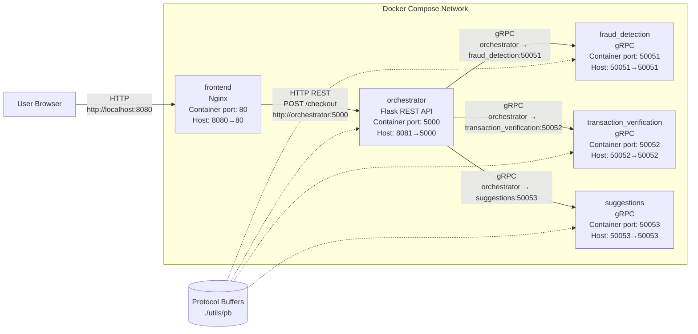
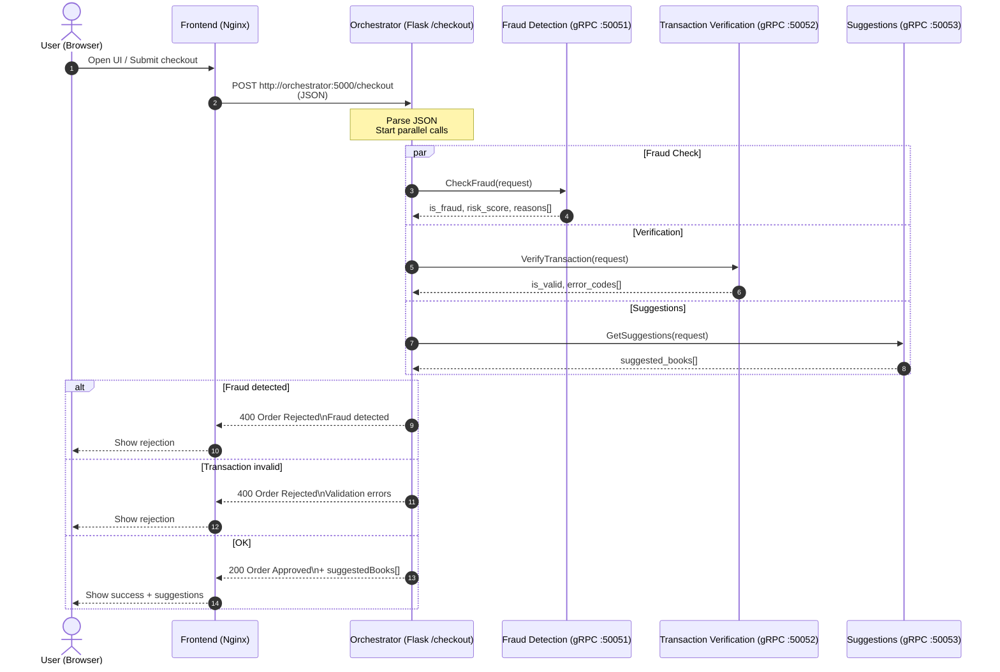

# Documentation

## Services Overview

This system consists of four main services: three backend microservices (fraud_detection, transaction_verification, suggestions) and an orchestrator that coordinates them. All services communicate via gRPC, with protocol buffers defined in the `utils/pb` folder.

### Fraud Detection Service

Located in `fraud_detection/`, this service implements a heuristic-based fraud detection system. It evaluates transaction requests for potential fraud by calculating a risk score based on multiple factors:

- **Credit Card Validation**: Checks for missing card number, CVV, or invalid card length.
- **Items Analysis**: Flags high quantities (>10 items) or empty carts.
- **Address Verification**: Ensures billing country is provided.
- **Terms Acceptance**: Requires terms to be accepted.

The service assigns points to each risk factor (e.g., missing CVV: +30 points, terms not accepted: +50 points). If the total score reaches 70 or more, the transaction is flagged as fraudulent. The response includes the fraud decision, risk score, and specific reasons for the score.

### Transaction Verification Service

Located in `transaction_verification/`, this service validates the completeness and correctness of transaction data. It performs comprehensive checks on:

- **User Information**: Validates name and email format.
- **Items**: Ensures items have names and positive quantities, and the cart is not empty.
- **Credit Card**: Verifies card number length/format, expiration date (MM/YY format, not expired), and CVV (3-4 digits).
- **Billing Address**: Requires all address fields (street, city, state, zip, country).
- **Shipping Method**: Accepts only "Standard" or "Express".
- **Terms Acceptance**: Must be true.

If any validation fails, the service returns a list of error codes. A transaction is valid only if no errors are found.

### Suggestions Service

Located in `suggestions/`, this service provides personalized book recommendations. It maintains a static catalog of 10 books and suggests up to 3 books that the user hasn't already ordered. The suggestions are based on filtering out books with titles matching the ordered items (case-insensitive).

The service uses a simple exclusion-based approach: remove ordered books from the catalog and return the first 3 remaining books.

### Orchestrator

Located in `orchestrator/`, this service acts as the main API gateway, exposing a REST endpoint (`/checkout`) that coordinates the three backend services. It uses threading to call all three services in parallel for improved performance:

- **Parallel Execution**: Launches three threads simultaneously to call fraud_detection, transaction_verification, and suggestions services.
- **Result Aggregation**: Collects results from all services into a shared dictionary.
- **Decision Logic**: Rejects orders if fraud is detected or transaction is invalid. Otherwise, approves the order and includes suggestions.

The orchestrator handles errors gracefully by logging exceptions and proceeding with default values (e.g., assuming no fraud if the service fails). It uses Flask with CORS enabled for the REST API and communicates with backend services via gRPC channels.

## Architecture

## System Flow

