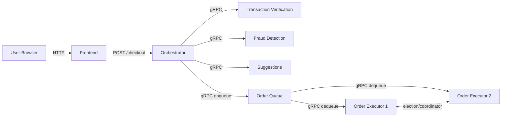
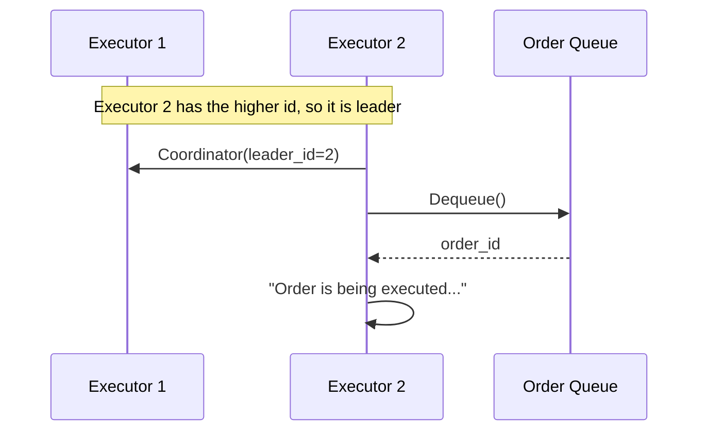
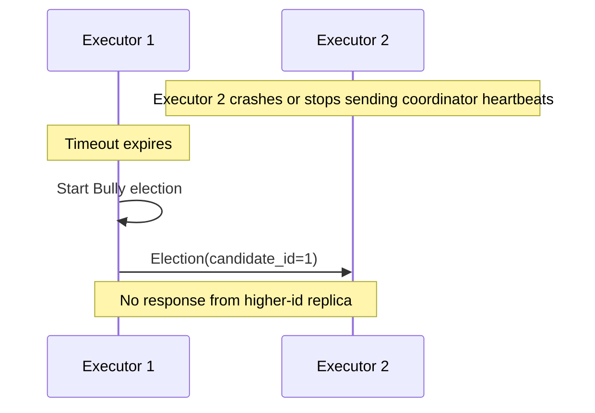
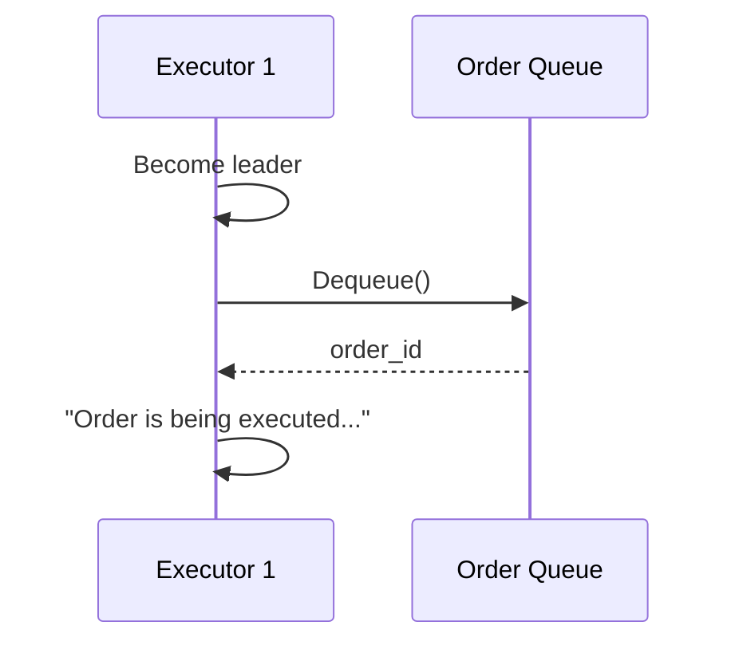

# Checkpoint 2 Documentation

## Overview

For Checkpoint 2 we extended the original bookstore system with two main additions:

- a vector-clock based two-phase execution flow for `transaction_verification`, `fraud_detection`, and `suggestions`
- an asynchronous execution stage based on an `order_queue` service and replicated `order_executor` services

The general service overview is kept in [README.md](/C:/Users/nikit/Documents/University/DistributedSystems/ds-practice-2026/docs/README.md). This document focuses only on the Checkpoint 2 additions.

## Relevant Code

The most relevant parts of the implementation are:

- [orchestrator/src/app.py](/C:/Users/nikit/Documents/University/DistributedSystems/ds-practice-2026/orchestrator/src/app.py)
  The orchestrator creates `order_id`, initializes all validation services, propagates vector clocks during the execution pipeline, and enqueues approved orders.

- [utils/vector_clock.py](/C:/Users/nikit/Documents/University/DistributedSystems/ds-practice-2026/utils/vector_clock.py)
  This is the shared vector clock utility. It implements send, receive, and local events, together with happened-before and concurrency checks.

- [transaction_verification/src/app.py](/C:/Users/nikit/Documents/University/DistributedSystems/ds-practice-2026/transaction_verification/src/app.py)
  This service caches orders in phase 1 and executes events `a`, `b`, and `c` in phase 2. Events `a` and `b` are concurrent, while `c` depends on `a`.

- [fraud_detection/src/app.py](/C:/Users/nikit/Documents/University/DistributedSystems/ds-practice-2026/fraud_detection/src/app.py)
  This service caches the order first and then executes fraud events `d` and `e`, with `e` happening after `d`.

- [suggestions/src/app.py](/C:/Users/nikit/Documents/University/DistributedSystems/ds-practice-2026/suggestions/src/app.py)
  This service executes event `f` after receiving the full causal history from the fraud service.

- [order_queue/src/app.py](/C:/Users/nikit/Documents/University/DistributedSystems/ds-practice-2026/order_queue/src/app.py)
  This service implements a thread-safe FIFO queue with `Enqueue` and `Dequeue`.

- [order_executor/src/app.py](/C:/Users/nikit/Documents/University/DistributedSystems/ds-practice-2026/order_executor/src/app.py)
  This service implements replicated order execution and Bully-style leader election. Only the elected leader is allowed to dequeue and execute the next order.

- [docker-compose.yaml](/C:/Users/nikit/Documents/University/DistributedSystems/ds-practice-2026/docker-compose.yaml)
  This file defines the full deployment, including the two replicated executors.

## Checkpoint 2 Architecture



## System Model

The system follows a microservice architecture with one HTTP entry point and multiple gRPC backend services.

- The frontend is a simple client for the user.
- The orchestrator is the API gateway and coordination component.
- `transaction_verification`, `fraud_detection`, and `suggestions` are stateful gRPC services because they cache orders between the init and run phases.
- `order_queue` is a centralized FIFO queue.
- `order_executor` is replicated and runs the same code in multiple containers.

Communication model:

- frontend to orchestrator: HTTP
- orchestrator to validation services: gRPC
- orchestrator to order queue: gRPC
- executors to order queue: gRPC
- executors to executors: gRPC

Consistency model:

- causal ordering between validation events is represented with vector clocks
- queue access is controlled by leader election, so only the current leader dequeues

Failure model:

- if a validation service fails, the orchestrator rejects the order or returns a degraded response depending on the stage
- if the queue is unavailable after approval, the user still receives the approval but the response includes a warning
- if the current executor leader fails, the remaining replicas start a new election
- the Bully algorithm assumes that replicas can compare ids and eventually detect missing coordinator heartbeats

## Successful Order Flow

The orchestrator uses a two-phase protocol:

1. It initializes all validation services in parallel and sends `order_id` to each of them.
2. It executes the causal pipeline `transaction_verification -> fraud_detection -> suggestions`.
3. If the order is approved, it enqueues the order in `order_queue`.
4. The elected executor dequeues the order and logs that execution has started.

## Vector Clock Diagram

Below is one successful execution. We label the orchestrator send events as `ot`, `of`, and `os`. The service events are:

- `a`: item validation
- `b`: user data validation
- `c`: card validation
- `d`: fraud checks on user, basket, address, terms
- `e`: fraud checks on card
- `f`: suggestion generation

Vector clock component order:

`(orchestrator, txn, fraud, suggestions)`

```text
Orchestrator    ot(4,0,0,0) ---------------- of(6,3,0,0) ---------------- os(8,3,3,0)
Txn items          a(4,2,0,0)
Txn user           b(4,2,0,0)
Txn card                      c(4,3,0,0)
Fraud                                                d(6,3,2,0) --- e(6,3,3,0)
Suggestions                                                                          f(8,3,3,2)
```

Important causal relations:

- `a || b`
- `a -> c`
- `b -> d`
- `c -> d`
- `d -> e`
- `e -> f`

The order above comes from the implemented logic:

- the orchestrator sends the transaction run request with `ot`
- transaction receives `ot`, then executes `a` and `b` concurrently
- event `c` merges the history of `a`
- the orchestrator merges the transaction result and sends the fraud request with `of`
- fraud executes `d` and then `e`
- the orchestrator merges the fraud result and sends the suggestions request with `os`
- suggestions executes `f`

## Leader Election

For leader election we chose the Bully algorithm.

Reason for this choice:

- the number of executor replicas is small
- each replica already has a numeric id
- the highest live id can become leader without introducing a separate coordinator service
- the implementation is relatively small and fits the checkpoint scope

### Picture 1: Normal State



### Picture 2: Leader Failure



### Picture 3: New Leader



## Docker Setup

The base Docker workflow is already described in the main documentation. For Checkpoint 2, the important deployment changes are:

- `order_queue` was added as a new service
- `order_executor` was added as a replicated service with two containers
- both executor containers run the same code but use different `EXECUTOR_ID`, `EXECUTOR_PORT`, and `EXECUTOR_PEERS` values

This is how replication is achieved in the current setup.
