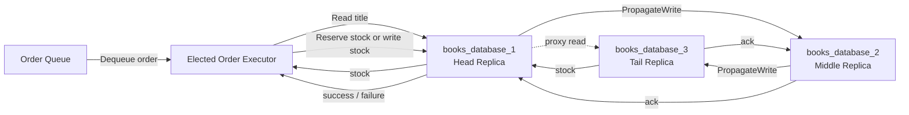
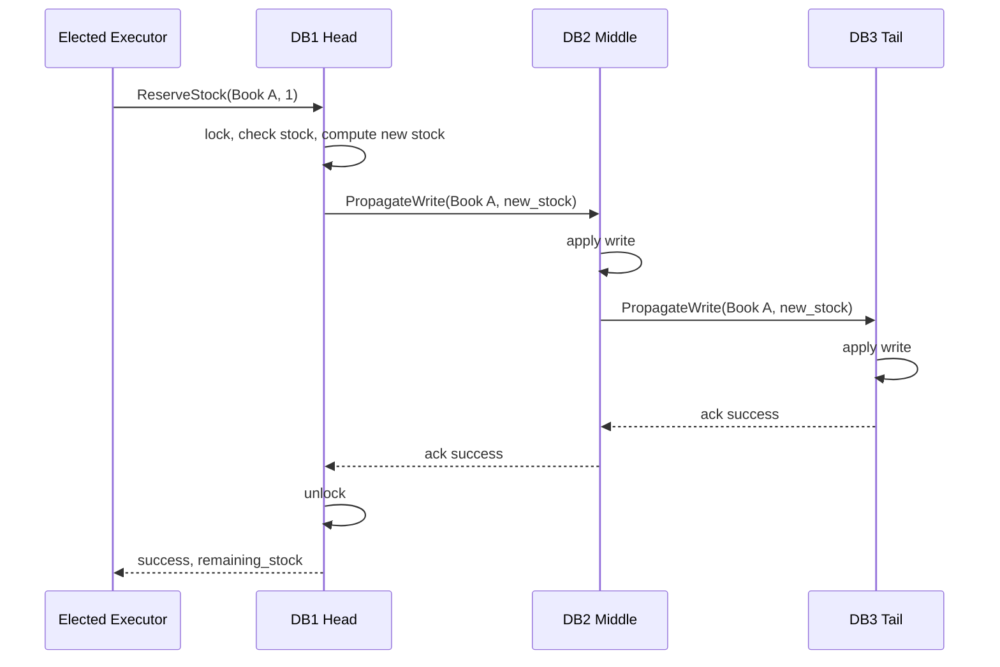
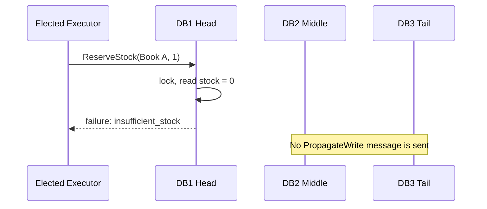
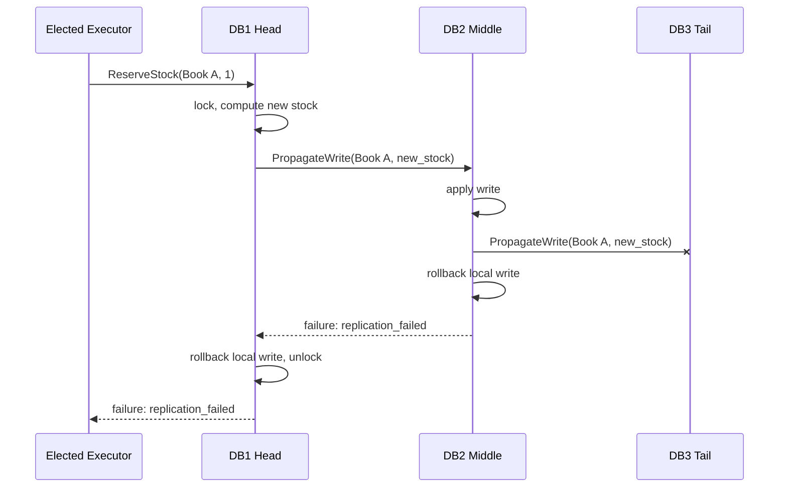
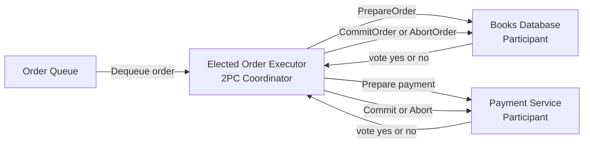
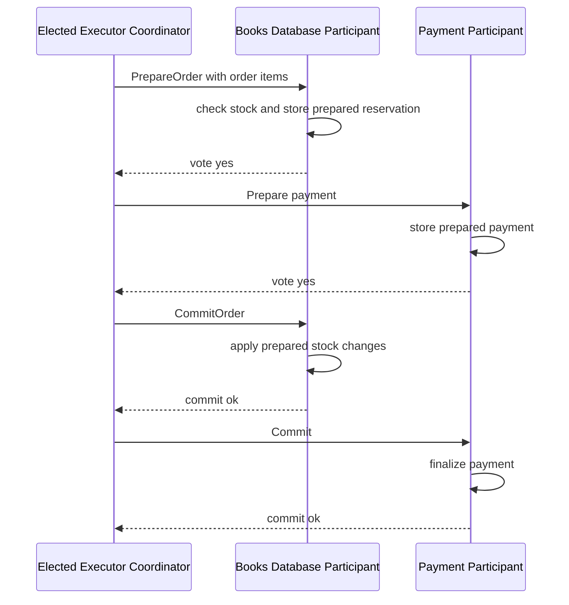
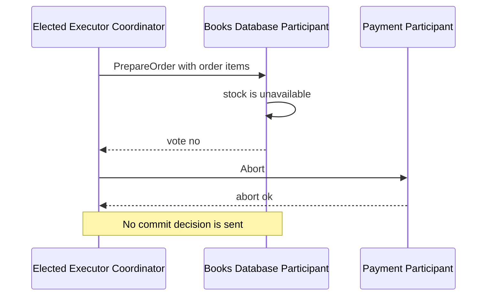
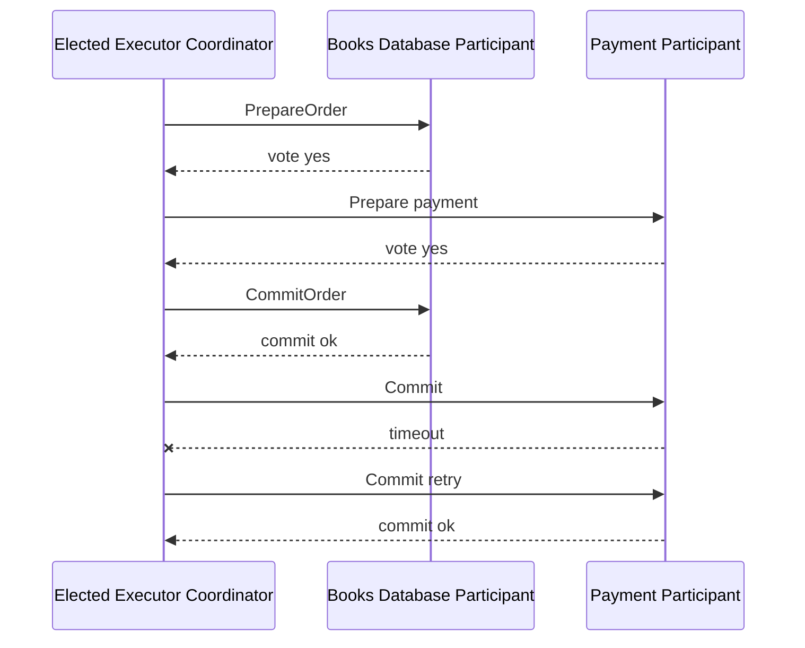

# Checkpoint 3 Books Database

## Overview

This checkpoint adds a replicated key-value books database. The key is the book
title and the value is the available stock count. The public database operations
are `Read` and `Write`, with an extra `ReserveStock` operation used by order
executors to handle concurrent purchases atomically.

## Services

- `books_database_1`: head replica
- `books_database_2`: middle replica
- `books_database_3`: tail replica
- `order_executor_1` and `order_executor_2`: replicated executors with Bully
  leader election
- `order_queue`: stores approved orders including item titles and quantities

## Consistency Protocol

The database uses chain replication:

1. Clients may call any replica, but writes are routed to the head.
2. The head applies a write locally and forwards it to the middle replica.
3. The middle replica applies the write and forwards it to the tail.
4. The write is acknowledged only after the downstream chain accepts it.
5. Reads are routed to the tail replica.

Because reads come from the tail and successful writes are acknowledged only
after propagation through the chain, clients observe a single serialized order of
committed writes. This provides sequential consistency for successful operations.

## Why Chain Replication

Chain replication was chosen instead of a primary-backup
setup because the main database operation in this project is stock reservation.
For stock, the most important property is that clients do not observe or act on
partially replicated updates. Chain replication gives a simple rule for this:
writes enter at the head, reads come from the tail, and a write is considered
committed only after it reaches the tail.

In a primary-listener setup, the primary would accept writes and notify backup
listeners. This is simpler and can be faster for the primary to respond if it
does not wait for all listeners, but that creates a risk that a client sees a
successful stock update before every backup has received it. If the primary
fails at that moment, replicas may disagree about the latest stock. The primary
can wait for backup acknowledgments to improve consistency, but then the primary
becomes the central bottleneck for both ordering and acknowledgment management.

Chain replication fits this use case because:

- It gives a clear committed state: the tail has all acknowledged writes.
- Reads from the tail avoid stale backup reads.
- The write order is naturally serialized through the chain.
- The protocol is easy to explain and implement with three fixed replicas.
- It works well for stock, where correctness is more important than returning a
  fast but possibly unsafe success.

The trade-offs are:

- Write latency is higher because each write must travel through all replicas.
- Reads concentrate on the tail replica.
- If the middle or tail replica fails, writes fail unless the chain is
  reconfigured.
- The current implementation does not include automatic chain reconfiguration,
  so it favors consistency over availability.

Primary-listener replication would be a reasonable choice if the system needed
lower write latency, simpler failover, or higher availability with weaker
consistency. For this checkpoint, chain replication is a better fit because
overselling books is worse than temporarily rejecting or delaying an order.

## Concurrent Orders

Concurrent stock decrements are handled by `ReserveStock`.

`ReserveStock(title, quantity)` is routed to the head replica. The head keeps a
write lock, checks the current stock, calculates the new value, and commits that
new value through the chain as one serialized operation. This prevents lost
updates when two orders try to buy the same book at the same time.

The executor still performs a `Read` before reservation for logging and to match
the assignment flow, but correctness does not depend on the read result.

## Trade-offs

- Reads are consistent but concentrated on the tail replica.
- Writes are serialized at the head, so write throughput is limited by the head
  and by propagation through the chain.
- If a middle or tail replica is unavailable, new writes fail instead of being
  acknowledged on only part of the chain.
- This implementation does not perform automatic chain reconfiguration after a
  database replica failure. It favors consistency over availability.

## Order Flow

1. The orchestrator validates the checkout request.
2. Approved orders are enqueued with item titles and quantities.
3. The elected order executor dequeues the next order.
4. For each item, the executor reads the current stock and calls
   `ReserveStock`.
5. The database commits the reservation through the chain.

## Diagrams

### Consistency Protocol

The database module uses chain replication. The executor can contact the database
through the head replica. Writes and stock reservations are serialized at the
head and propagated through the chain. Reads are routed to the tail so clients
observe committed state.

### Chain Replication: Successful Reservation

This is the normal commit path for one stock reservation. The operation commits
only after the write reaches the tail and acknowledgments return to the head.

### Chain Replication: Insufficient Stock

If the head replica sees that the current stock is too low, it rejects the
reservation before propagating anything. No replica state changes.

### Chain Replication: Propagation Failure

If a downstream replica cannot acknowledge the write, the operation fails. The
head/middle replica rolls back its local change for detectable propagation
failures, so the client does not treat a partially replicated write as committed.

### Distributed Commitment Protocol: 2PC Overview

The order execution stage uses two-phase commit across two participants:
`books_database` and `payment`. The elected order executor acts as the 2PC
coordinator. The database participant prepares stock reservations, while the
payment participant prepares the payment. The order is committed only if both
participants vote yes during prepare.

### Distributed Commitment Protocol: Successful 2PC

In the successful case, both participants prepare successfully. The coordinator
then sends commit messages. The executor retries commit messages until each
participant confirms the commit, which makes commit handling idempotent and
tolerant of temporary timeout failures.

### Distributed Commitment Protocol: Prepare Failure

If any participant votes no or fails during prepare, the coordinator aborts all
participants that were already prepared. This prevents stock from being reserved
without payment, or payment being prepared without stock.

### Distributed Commitment Protocol: Commit Retry

Once all participants vote yes, the coordinator has decided to commit. If a
participant times out during commit, the executor keeps retrying until it gets a
successful response. This matches the current payment service behavior, where
commit is idempotent and may temporarily sleep to simulate a failure.

